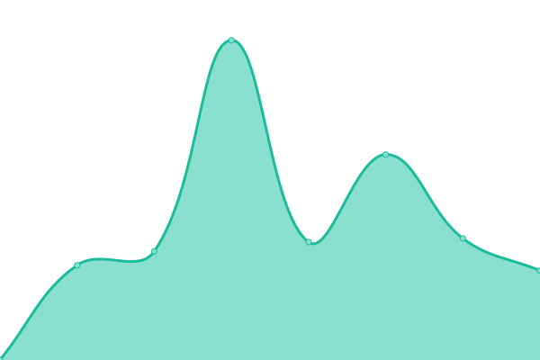

# [📈 Live Status](https://dsm.klib.cn:5443): <!--live status--> **🟩 All systems operational**

This repository contains the open-source uptime monitor and status page for [Hills](https://github.com/hillsdong/), powered by [Upptime](https://github.com/upptime/upptime).

With [Upptime](https://upptime.js.org), you can get your own unlimited and free uptime monitor and status page, powered entirely by a GitHub repository. We use [Issues](https://github.com/hillsdong/klib_upptime/issues) as incident reports, [Actions](https://github.com/hillsdong/klib_upptime/actions) as uptime monitors, and [Pages](https://hillsdong.github.io/klib_upptime) for the status page.

<!--start: status pages-->
<!-- This summary is generated by Upptime (https://github.com/upptime/upptime) -->
<!-- Do not edit this manually, your changes will be overwritten -->
<!-- prettier-ignore -->
| URL | Status | History | Response Time | Uptime |
| --- | ------ | ------- | ------------- | ------ |
|  [DSM](https://dsmcf.klib.cn) | 🟩 Up | [dsm.yml](https://github.com/hillsdong/klib_upptime/commits/HEAD/history/dsm.yml) | 

 1155ms
     
 | 

<a href="https://hillsdong.github.io/klib_upptime/history/dsm">79.24%</a>
    

|  [Webdav](https://webdavcf.klib.cn) | 🟩 Up | [webdav.yml](https://github.com/hillsdong/klib_upptime/commits/HEAD/history/webdav.yml) | 

 1062ms
     
 | 

<a href="https://hillsdong.github.io/klib_upptime/history/webdav">69.65%</a>
    

<!--end: status pages-->

[**Visit our status website →**](https://hillsdong.github.io/klib_upptime)

## 📄 License

- Powered by: [Upptime](https://github.com/upptime/upptime)
- Code: [MIT](./LICENSE) © [Hills](https://github.com/hillsdong/)
- Data in the `./history` directory: [Open Database License](https://opendatacommons.org/licenses/odbl/1-0/)
